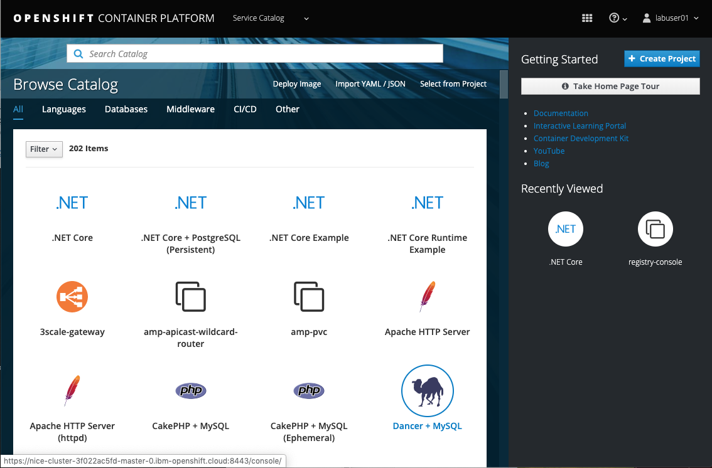
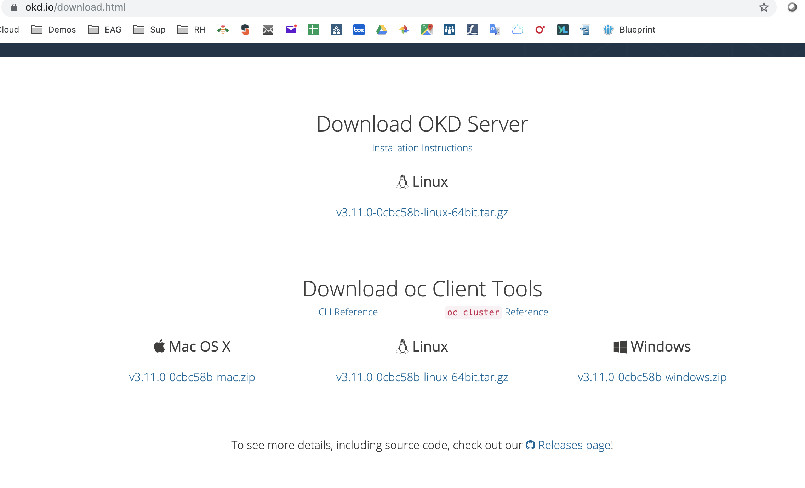
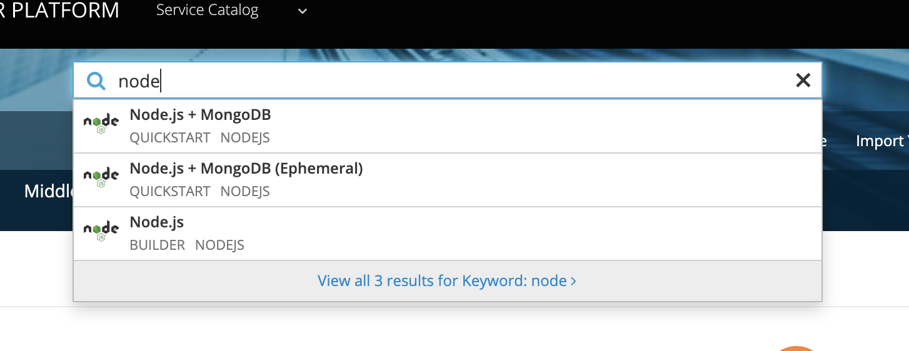
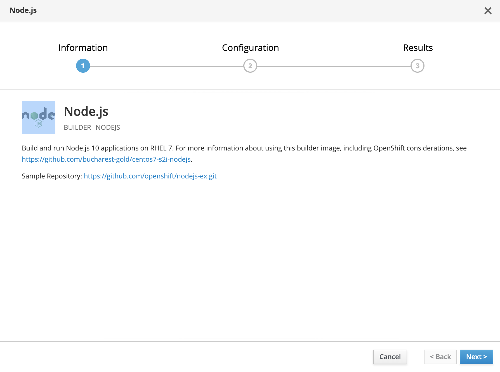
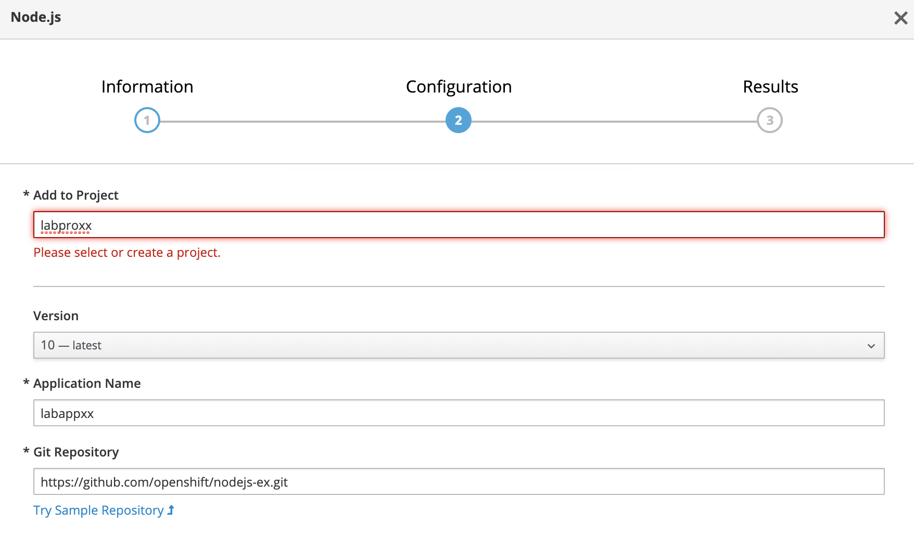
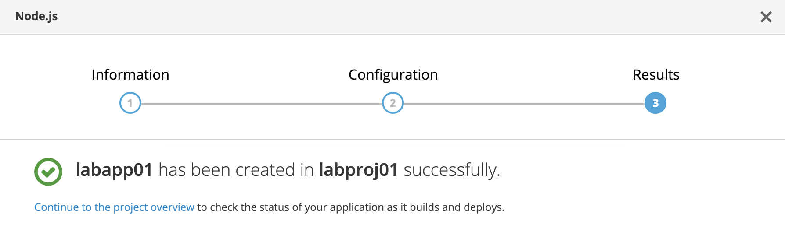
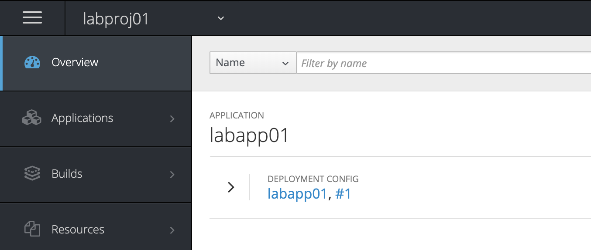
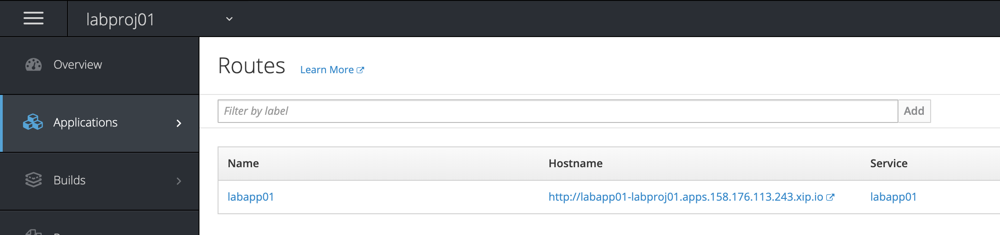
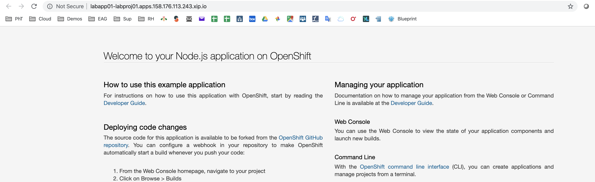

# OpenShift First Steps Labs


Duration: 30 minutes


##  Introduction

During this lab, we are going to set up your laptop to be prepared to all labs during this workshop. You should be able to connect to an **OpenShift** Cluster thru the Web Console and navigate thru the different kubernetes resources.

The instructor has already built a POC OpenShift Cluster for you. 


As you can see on the picture, you will connect to the OpenShift Cluster Web UI to the Master for management and development purposes. The end-users will connect to the applications thru the Infra Node.


## Task #1 - Modifying your environment

The instructor will give you some informations:

- a user ID and password to connect to the Master Node. The user ID is in the format **labuser<xx>** where xx is a number from 00 to 99. Don't use someone else userID except if the instructor ask you to do so. 
- a project name in the format **labproj<xx>**. Each project is associated to the corresponding labuser<xx>. 

The instructor will give you a specific line **similar** to this one in the following format:

```
<IP address>   <hostname>   <Fully Qualified Hostname>
```

As an example:

> 149.81.75.121   nicekm0    nicekm0.ibm.ws


Take a note of the instructor line and append this line in your **laptop /etc/hosts** file:


- [ ] For Linux and MacOS, open a terminal:

```bash
sudo nano /etc/hosts
```

Save the file (Ctrl O, Enter, Ctrl X).


- [ ] For Windows, use notepad to edit the foolowing file:

```
c:\Windows\System32\Drivers\etc\hosts
```

Save the file.

Do **not** reboot your laptop.


## Task #2 - Connecting to the Web Console

You can now use the following link in your preferred browser :

```http
https://<Fully Qualified Hostname>:8443
```

Please take a note of this link because we will use it very often.

You should see the following page after a few seconds:


Type your credentials (**user ID, password**) and click **Log in**




**<u>Important note</u>** : You need to modify your **/etc/hosts** and add the given line at the end of the file otherwise you will get a redirection or a page-notfound problem (404, 403 or 401). 

> Be very careful when you type the line especially on the IP address and the hostnames. 
>
>

##  Task #3 - Installing the OpenShift CLI

In fact, you will need to use the **oc** command during the labs. If you need some more information during the installation, go to that link

<https://cloud.ibm.com/docs/openshift?topic=openshift-openshift-cli>

This link is very practical to download both the **oc** and the associated **kubectl**.

> During the labs, you will notice that the oc command is a superset of the kubectl command. 
>
> To view a local version of the OpenShift dashboard and to deploy apps into your Red Hat OpenShift on IBM Cloud clusters, install the OpenShift Origin CLI (`oc`). The `oc` CLI includes a matching version of the Kubernetes CLI (`kubectl`). For more information, see the [OpenShift docs ](https://docs.openshift.com/container-platform/3.11/cli_reference/get_started_cli.html).


### 1. Download the zip file corresponding to your Operating System

[Download the OpenShift Origin CLI ](https://www.okd.io/download.html) for your local operating system and OpenShift version. The current default OpenShift version is 3.11. Choose the Operating System in the `Download oc Client Tools`




### 2. Move the binaries to the right directory

If you use **MacOS** or Linux, complete the following steps to add the binaries to your `PATH` system variable. If you use **Windows**, install the `oc` CLI in any other directory that is listed in your `PATH`  system variables. This setup saves you some file path changes when you run commands later.


1. Extract and Move the `oc` and `kubectl` executable files to the `/usr/local/bin` directory.

   ```
   mv /<filepath>/oc /usr/local/bin/oc
   mv /<filepath>/kubectl /usr/local/bin/kubectl
   ```

2. Make sure that `/usr/local/bin` is listed in your `PATH` system variable. The `PATH` variable contains all directories where your operating system can find executable files. The directories that are listed in the `PATH` variable serve different purposes. `/usr/local/bin` is used to store executable files for software that is not part of the operating system and that was manually installed by the system administrator.

   ```
   echo $PATH
   ```

   Example CLI output:

   ```
   /usr/local/bin:/usr/bin:/bin:/usr/sbin:/sbin
   ```


### 3. Check the OC command

Open a terminal or a command line console and type:

```shell
oc login https://<Cluster Master Hostname>:8443
```

Then enter your credentials (userID and password) as an example:

```shell
Authentication required for https://nice-cluster-3f022ac5fd-master-0.IBM-OpenShift.cloud:8443 (openshift)
Username: labuser01
Password: 
Login successful.

You don't have any projects. You can try to create a new project, by running

    oc new-project <projectname>

#
```

> **You don't need to create a new project because a new secure project space has already been created for you.** 

If you had to create a new project, you would have typed : oc new-project labproj<xx> where **xx** is your number.

To switch to your project:

``` bash
oc project labproj<XX>
```

Results as an example:

```shell
oc project labproj01
Now using project "labproj01" on server "https://nice-cluster-3f022ac5fd-master-0.IBM-OpenShift.cloud:8443".
```


To understand what project you are using:

```
oc projects
```

Results:

```shell
oc projects
You have one project on this server: "labproj01".

Using project "labproj01" on server "https://nice-cluster-3f022ac5fd-master-0.IBM-OpenShift.cloud:8443".
# 
```

In the case of using multiple projects, you can change from one project to another one, use the following command :

``` shell
oc project <another project>
```

Now you are ready to go thru the exercises. 


## Task #4 - Deploy some code

Now go back to the Web UI and deploy your first application.

From the **catalog console**, find the **Node.js** tile. 




Select **Node.js** entry:



You can have a look to the github **sample** repository. 

Click **next**.



Replace xx with your own number:

- labproj<xx> in the add to project field
- labapp<xx> in the Application name
- https://github.com/openshift/nodejs-ex.git  in the git repository where we have our code




Click **close**.

Go back to the Catalog Console and click on **view all** to select your project **labproj<xx>**.


As an example in the **application console**, you should see you application deployment **labapp<xx>**:



If you drill down, at some point you should see your pod running:


To get access to your application, you have to find the route: go to **Application** on the left pane and the choose **Route**:



Click on the hostname link and voilà ! You get access to your application.




## Conclusion

**Congrats !**  You successfully installed and used the oc CLI and the OpenShift web console thru the installation of a typical Node.JS application (from Github). 

You noticed the following details:

- easy to install for the oc CLI
- easy to access the OpenShift web console
- easy to build and deploy a simple application with the console.


----

----


# End of Lab


