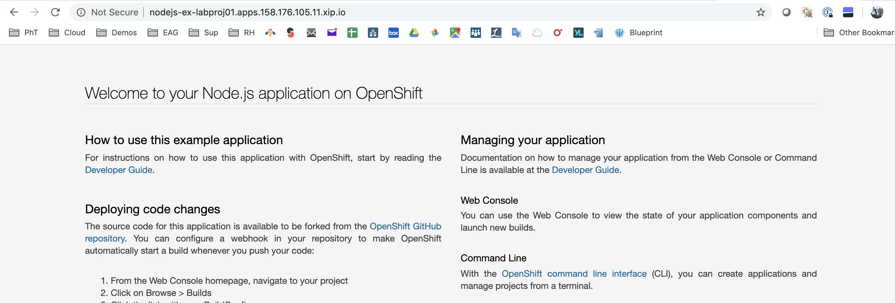
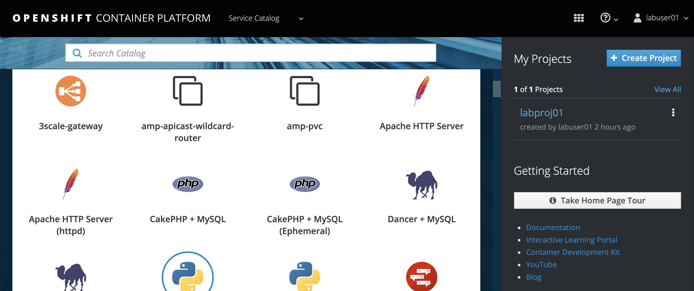
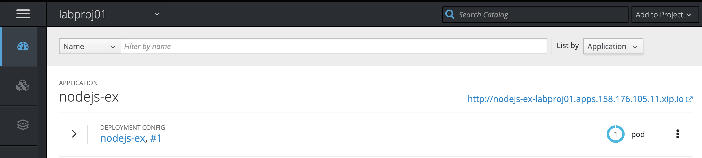
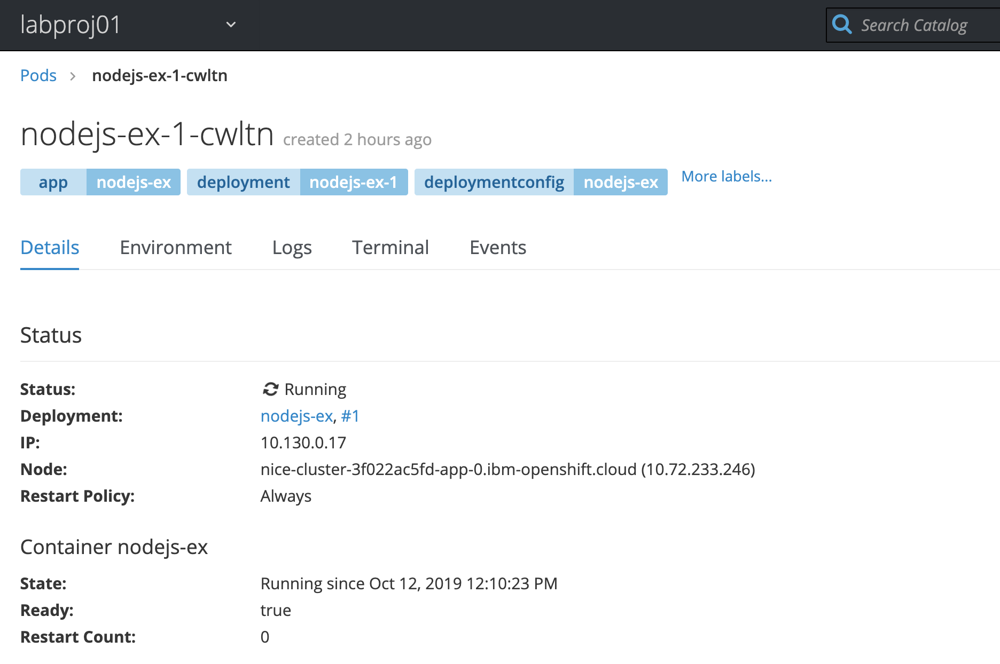
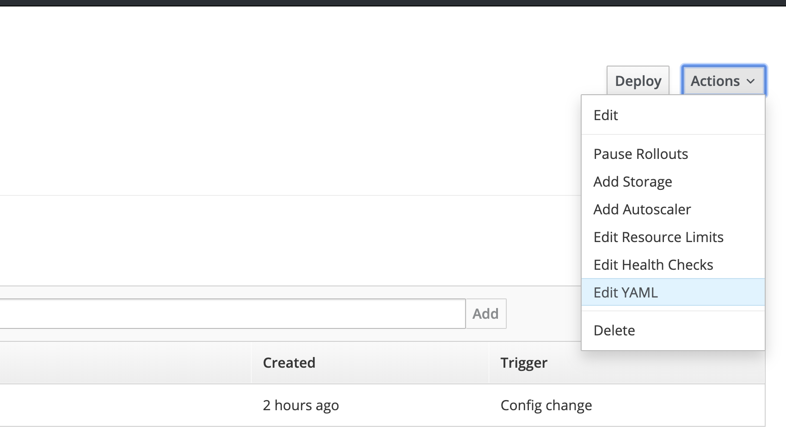
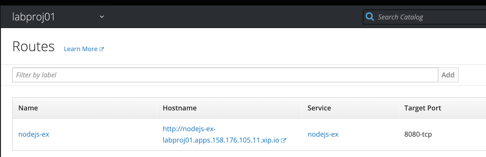
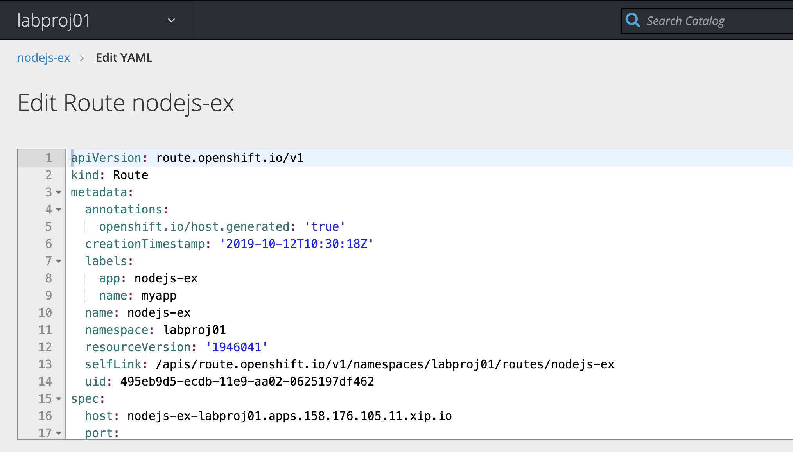
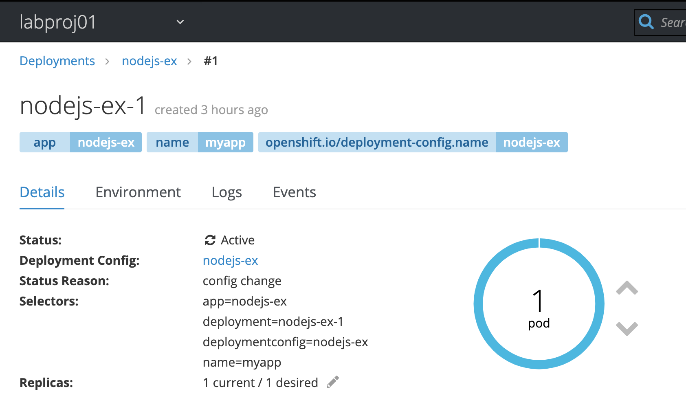
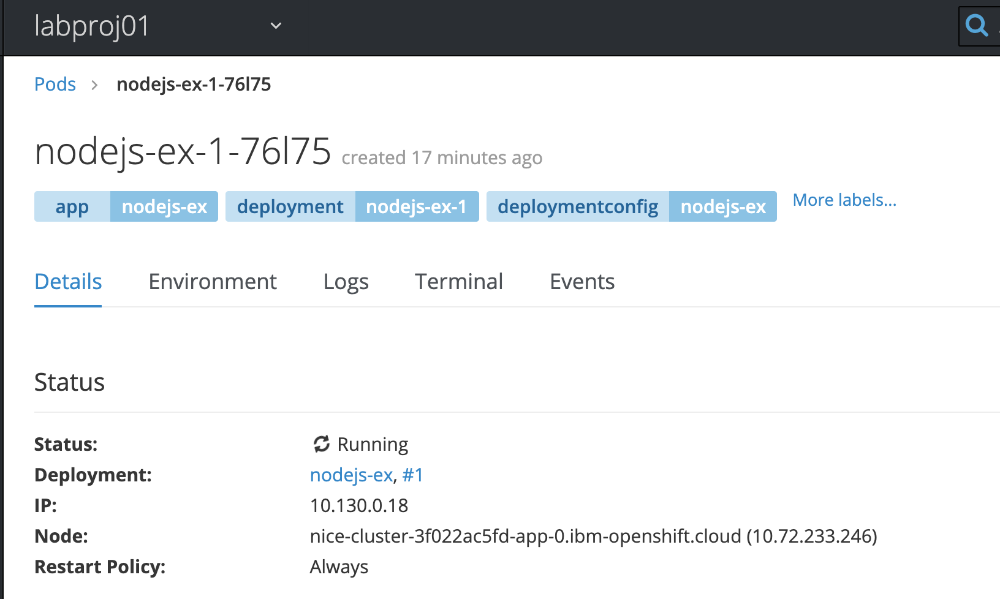

# Basic Concepts on OpenShift Console & CLI


## Introduction

During this lab we are going to connect to an **OpenShift** Cluster thru the Web Console or using CLI. Then we will deploy a sample application.

Be sure that you have your **labuser**xx userID with xx representing a number from 00 to 99. You also have been set a password associated to labuserxx. 

Don't use someone else userID except if the instructor ask you to do so. 

> So you should have for example : **labuser01** and a password (given by the instructor at the time of the lab).


##Task #1 - Connecting to the Web Console

Use the following URL with you credentials (labuserxx, passwordxx) to connect to the OpenShift Web Console :

[https://nice-cluster-3f022ac5fd-master-0.IBM-OpenShift.cloud:8443](https://nice-cluster-3f022ac5fd-master-0.ibm-openshift.cloud:8443/)


Type your credentials


**<u>Important note</u>** : You need to modify your /etc/hosts and add the following line otherwise you will get a redirection or a page-notfound problem (404, 403 or 401). 

```
158.176.105.4 nice-cluster-3f022ac5fd-master-0.IBM-OpenShift.cloud
```


## Task #2 - Installing the OpenShift CLI

In fact, you will need to use the **oc** command during the labs. If you need some more information during the installation, go to that link

<https://cloud.ibm.com/docs/openshift?topic=openshift-openshift-cli>

This link is very practical to download both the **oc** and the associated **kubectl**.

> During the labs, you will notice that the oc command is a superset of the kubectl command. 
>
> To view a local version of the OpenShift dashboard and to deploy apps into your Red Hat OpenShift on IBM Cloud clusters, install the OpenShift Origin CLI (`oc`). The `oc` CLI includes a matching version of the Kubernetes CLI (`kubectl`). For more information, see the [OpenShift docs ](https://docs.openshift.com/container-platform/3.11/cli_reference/get_started_cli.html).


### 1. Download the zip file corresponding to your Operating System

[Download the OpenShift Origin CLI ](https://www.okd.io/download.html) for your local operating system and OpenShift version. The current default OpenShift version is 3.11. Choose the Operating System in the `Download oc Client Tools`


### 2. Move the binaries to the right directory

If you use **MacOS** or Linux, complete the following steps to add the binaries to your `PATH` system variable. If you use **Windows**, install the `oc` CLI in the same directory as the IBM Cloud CLI or any other directory that is listed in your `PATH`  system variables. This setup saves you some file path changes when you run commands later.


1. Extract and Move the `oc` and `kubectl` executable files to the `/usr/local/bin` directory.

   ```
   mv /<filepath>/oc /usr/local/bin/oc
   mv /<filepath>/kubectl /usr/local/bin/kubectl
   ```

2. Make sure that `/usr/local/bin` is listed in your `PATH` system variable. The `PATH` variable contains all directories where your operating system can find executable files. The directories that are listed in the `PATH` variable serve different purposes. `/usr/local/bin` is used to store executable files for software that is not part of the operating system and that was manually installed by the system administrator.

   ```
   echo $PATH
   ```

   Example CLI output:

   ```
   /usr/local/bin:/usr/bin:/bin:/usr/sbin:/sbin
   ```


### 3. Check the new commands

Open a terminal or a command line console and type:

```shell
oc login https://nice-cluster-3f022ac5fd-master-0.IBM-OpenShift.cloud:8443
```

Then enter your credentials (userID and password).

```shell
Authentication required for https://nice-cluster-3f022ac5fd-master-0.IBM-OpenShift.cloud:8443 (openshift)
Username: labuser01
Password: 
Login successful.

You don't have any projects. You can try to create a new project, by running

    oc new-project <projectname>

#
```

Then create a new project for this user :

```
oc new-project labproj<xx>
```

where **xx** is your number. 

Results as an example:

```shell
oc new-project labproj01
Now using project "labproj01" on server "https://nice-cluster-3f022ac5fd-master-0.IBM-OpenShift.cloud:8443".

You can add applications to this project with the 'new-app' command. For example, try:

    oc new-app centos/ruby-25-centos7~https://github.com/sclorg/ruby-ex.git

to build a new example application in Ruby.
```

A new secure project space has been created for you. 

To understand what project you are using:

```
oc projects
```

Results:

```shell
oc projects
You have one project on this server: "labproj01".

Using project "labproj01" on server "https://nice-cluster-3f022ac5fd-master-0.IBM-OpenShift.cloud:8443".
# 
```

In the case of using multiple projects, you can change from one project to another one, use the following command :

``` shell
oc project <another project>
```


Now you are ready to go thru the exercises. 


## Task #3 - Starting a basic application

For this exercise, we will use the CLI and then the OpenShift web console.

We already have a basic node.js application that you can see here (thanks to sclorg):

<https://github.com/sclorg/nodejs-ex>


Create a new instance Node.js application based on this GitHub example:

```bash
oc new-app https://github.com/sclorg/nodejs-ex -l name=myapp
```

After a few seconds:

```bash
oc new-app https://github.com/sclorg/nodejs-ex -l name=myapp
--> Found image 0d01232 (5 weeks old) in image stream "openshift/nodejs" under tag "10" for "nodejs"

    Node.js 10.16.3 
    --------------- 
    Node.js 10.16.3 available as a container is a base platform for building and running various Node.js 10.16.3 applications and frameworks. Node.js is a platform built on Chrome's JavaScript runtime for easily building fast, scalable network applications. Node.js uses an event-driven, non-blocking I/O model that makes it lightweight and efficient, perfect for data-intensive real-time applications that run across distributed devices.

    Tags: builder, nodejs, nodejs-10.16.3

    * The source repository appears to match: nodejs
    * A source build using source code from https://github.com/sclorg/nodejs-ex will be created
      * The resulting image will be pushed to image stream tag "nodejs-ex:latest"
      * Use 'start-build' to trigger a new build
    * This image will be deployed in deployment config "nodejs-ex"
    * Port 8080/tcp will be load balanced by service "nodejs-ex"
      * Other containers can access this service through the hostname "nodejs-ex"

--> Creating resources with label name=myapp ...
    imagestream.image.openshift.io "nodejs-ex" created
    buildconfig.build.openshift.io "nodejs-ex" created
    deploymentconfig.apps.openshift.io "nodejs-ex" created
    service "nodejs-ex" created
--> Success
    Build scheduled, use 'oc logs -f bc/nodejs-ex' to track its progress.
    Application is not exposed. You can expose services to the outside world by executing one or more of the commands below:
     'oc expose svc/nodejs-ex' 
    Run 'oc status' to view your app.

```


For that exercise, we just provide the code (the server.js file in the GitHub and some config files). 

> You can note that OpenShift if going to find itself that the provided code is Node.JS and then find a version 10 that can match this code. Then an image stream is built with the name **nodejs-ex** and stored in the registry. Then after the build, a deployment is done and the application is running with success.  


Track the build log until the app is built and deployed:

```bash
oc logs -f bc/nodejs-ex
```

Results:

```bash
oc logs -f bc/nodejs-ex
Cloning "https://github.com/sclorg/nodejs-ex" ...
	Commit:	e59fe7571f883db2ae2e53d555aef6d145c6f032 (Merge pull request #206 from liangxia/okd)
	Author:	Honza Horak <hhorak@redhat.com>
	Date:	Tue Oct 16 15:45:10 2018 +0200
Using docker-registry.default.svc:5000/openshift/nodejs@sha256:74a3ef2964efc03dfc239da3f09691b720ce54ff4bb47588864adb222133f0fc as the s2i builder image
---> Installing application source
---> Building your Node application from source
Current git config
url.https://github.com.insteadof=git@github.com:
url.https://.insteadof=ssh://
url.https://github.com.insteadof=ssh://git@github.com
core.repositoryformatversion=0
core.filemode=true
core.bare=false
core.logallrefupdates=true
remote.origin.url=https://github.com/sclorg/nodejs-ex
remote.origin.fetch=+refs/heads/master:refs/remotes/origin/master
branch.master.remote=origin
branch.master.merge=refs/heads/master
---> Installing dependencies
---> Using 'npm install -s --only=production'
added 120 packages from 343 contributors and audited 205 packages in 3.656s
found 6 vulnerabilities (2 low, 2 moderate, 1 high, 1 critical)
run `npm audit fix` to fix them, or `npm audit` for details
---> Pruning the development dependencies
npm info it worked if it ends with ok
npm info using npm@6.9.0
npm info using node@v10.16.3
npm timing stage:loadCurrentTree Completed in 326ms
npm timing stage:loadIdealTree:cloneCurrentTree Completed in 4ms
npm timing stage:loadIdealTree:loadShrinkwrap Completed in 166ms
npm timing stage:loadIdealTree:loadAllDepsIntoIdealTree Completed in 53ms
npm timing stage:loadIdealTree Completed in 262ms
npm timing stage:generateActionsToTake Completed in 18ms
npm timing stage:executeActions Completed in 55ms
npm timing stage:rollbackFailedOptional Completed in 1ms
npm timing stage:runTopLevelLifecycles Completed in 705ms
npm timing audit submit Completed in 440ms
npm http fetch POST 200 https://registry.npmjs.org/-/npm/v1/security/audits/quick 441ms
npm timing audit body Completed in 2ms
audited 205 packages in 1.1s
found 6 vulnerabilities (2 low, 2 moderate, 1 high, 1 critical)
run `npm audit fix` to fix them, or `npm audit` for details
npm timing npm Completed in 1546ms
npm info ok 
---> Cleaning up npm cache
---> Fix permissions on app-root

Pushing image docker-registry.default.svc:5000/labproj01/nodejs-ex:latest ...
Pushed 0/6 layers, 9% complete
Pushed 1/6 layers, 17% complete
Push successful

```


If you are familiar with Git, Docker and Kubernetes, you will notice several activities:

- a clone of the github repo 
- npm (because it is a Node.JS source) is going to be used to solve the lib dependencies. 
- Finally a docker container image is stored in the OpenShift registry (push)

To check that your application is running:

```bash
oc get pods
```

Results:

```bash
oc get pods            
NAME                READY     STATUS      RESTARTS   AGE
nodejs-ex-1-build   0/1       Completed   0          14m
nodejs-ex-1-cwltn   1/1       Running     0          13m
```


You will notice that one pod (job) has been completed for the build stage.

The other pod is still running (1/1) and this is our Node.JS application.

To make this application visible to the world, you should create a **route**. If you are familiar with Kubernetes, a route is very close concept of an ingress with the association of a DNS. 

Expose a route to the service:

```
oc expose svc/nodejs-ex
```

Results:

```bash
# oc expose svc/nodejs-ex
route.route.openshift.io/nodejs-ex exposed
```

But you don't know the route url yet. 

```
oc get route
NAME        HOST/PORT                                        PATH      SERVICES    PORT       TERMINATION   WILDCARD
nodejs-ex   nodejs-ex-labproj01.apps.158.176.105.11.xip.io             nodejs-ex   8080-tcp                 None

```

Now you get the url. Sample results:

``` 
nodejs-ex-labproj01.apps.158.176.105.11.xip.io
```

You can notice the following :

- the url contains the project name 
- and also the ip address of the infra node (in that case 158.176.105.11 ) 
- using xip.io dynamic domain name (see <http://xip.io/>) using wildcard domain name.


Get access to this new application :

Example:




## Task #4 - OpenShift Web Console

Goto the OpenShift Web Console (use your credentials if necessary)




On the right side, click on the blue link : **labproj<xx>**


You will switch from the `Service Catalog` to the `Application Console` 


to the `Application Console` 


This will show the new created application:



> The name of your application, the number of pod, the application URL link ...


To get access to the application, click on the route:


Click on the `nodes-ex, #1` blue link, then you will see some more details on the application: 


Walk thru all the buttons : 


## 

On the left side, click on **Pods**:


Click on the **running** Pod:


You will get this page:



Walk thru the different links to understand this application:


Like for example the logs:


Now, on the left part of the screen, click on `deployments`


Then click on the blue link `nodes-ex`


Click on the Actions button:



Then click on `Edit YAML`to look at the kubernetes resource definition:


 You will recognize the Kubernetes definition of a deployment. 

Finally from the left side of the screen, click on `routes`


And you will see the route definition for that deployment: 



And finally:




## Task #5 - Monitoring your application

To learn about monitoring of your application, on the left pane, click on the `Monitoring`icon:


You should see all the resources involved into your applcation in the cluster:


Walk thru some itmes like Pods or Builds where you can see some of the previous pages in this lab.

Go to Deployments (nodes-ex-1)



Finally, increase the number of pods (**not too much** - 2)


And after a while, you will see 2 active pods:


And at the bottom of the page:


This mens that now 2 pods are serving the requests. 

Now click on one of these new pods and you should a page like this one:

 

Let's try a crazy experience and kill this pod ! click on the action button and select `delete`


The following popup window will appear:


Click on `Delete` and you should see breifly your pod terminating.


A new pod is automatically started !!! Because the number of replicaset has been defined to **2** , even if a pod is crashing, it will be replace automatically by a new one. 


## Conclusion

You successfully installed and used the oc CLI and the OpenShift web console thru the installation of a typical Node.JS application (from Github). 

You noticed the following details:

- easy to install for the oc CLI
- easy to access the OpenShift web console
- easy to build and deploy the application, the container, the pod.
- easy to scale up and down 
- automatic healing

You also noticed the difference between Kubernetes and OpenShift like 

- the route concept
- the wildcard DNS utilization
- the image stream and S2I concepts to build the docker image

**Congrats**

----

----


# End of Lab


