# Kabanero-CodeWind-Appsody Tools 

# in the IBM Cloud Pak for Applications 


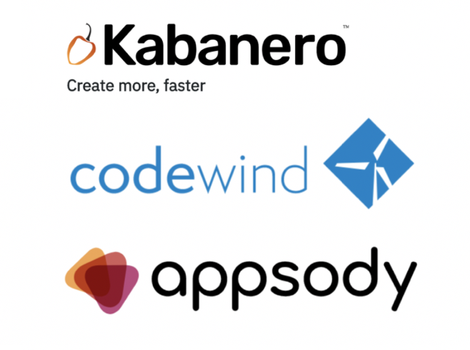


## Introduction

What is **Kabanero** ?

Kabanero is an open source project focused on bringing together foundational open source technologies into a modern microservices-based framework. Developing apps for container platforms requires harmony between developers, architects, and operations. Today’s developers need to be efficient at much more than writing code. Architects and operations get overloaded with choices, standards, and compliance. Kabanero speeds development of applications built for Kubernetes while meeting the technology standards and policies your company defines. Design, develop, deploy, and manage with speed and control!

What is **codewind** ?

Codewind simplifies and enhances development in containers by extending industry standard IDEs with features to write, debug, and deploy cloud-native applications. Get started quickly with templates or samples, or pull in your applications and let Codewind get them cloud ready. 

What is **Appsody** ?

Appsody is designed to help you develop containerized applications for the cloud.

If you're a software developer, our aim is to greatly improve your developer experience by removing the burden of managing the full software development stack. With Appsody, you can build applications for the cloud that are ready to be deployed to Kubernetes without being an expert on the underlying container technology. You can simply focus on the important stuff - developing application code!

If you're responsible for defining standards for application runtime environments such as software levels, Appsody allows you to control the stacks that your developers use. You can define a set of technologies that are configurable, reusable, and already infused with cloud native capabilities. You get to implement and maintain your standards, ensuring consistency and reliability.

All these components are working all together. 


## Task #1 - Connect to your OpenShift web console

Use the following URL with you credentials (labuserxx, passwordxx) to connect to the OpenShift Web Console :

`https://<cluster master hostname>:8443`


Enter your credentials


**<u>Important note</u>** : modify your /etc/hosts and add the following line otherwise you will get a redirection problem. This line will be given by the instructor.

For example:

```
158.176.105.4 nice-cluster-3f022ac5fd-master-0.IBM-OpenShift.cloud
```


## Task #2 - Installing Appsody on your laptop

Before starting working with Appsody, you should install it on your workstation. 

The master reference is on the following link:

```http
https://appsody.dev/docs/getting-started/installation
```


### Check Docker has been installed on your laptop

Because Appsody depends on Docker, ensure that you have [Docker](https://docs.docker.com/get-started/) installed and the Docker daemon running on your system. 

On MacOS

<https://docs.docker.com/docker-for-mac/install/>

On Windows

<https://docs.docker.com/docker-for-windows/install/>


## Installing Appsody on macOS

Follow these steps:

1. If you don't have the Xcode command line tools installed on your system, install them by running `xcode-select --install`.
2. If you don't have Homebrew installed on your system, install it by running `/usr/bin/ruby -e "$(curl -fsSL https://raw.githubusercontent.com/Homebrew/install/master/install)"`.
3. To install Appsody, run:

```
brew install appsody/appsody/appsody
```

This command creates a brew tap for the `appsody/appsody` repo and installs the `appsody` formula.

 

##  Installing Appsody on Windows

Note: Appsody runs only on Windows 10 Professional and Windows 10 Enterprise editions. If you are running Windows 10 Enterprise with authentication through Azure Active Directory, please follow the additional instructions in the page [Appsody and Docker Desktop on Windows 10](https://appsody.dev/docs/docker-windows-aad).

Follow these steps:

1. Create a directory for Appsody on your Windows 10 system.
2. Download the **Appsody binaries for Windows** from the [Appsody releases page](https://github.com/appsody/appsody/releases) into the directory. The file is named `appsody-v.r.m-windows.tar.gz`, where `v.r.m` indicates the release tag.
3. Extract the files by running `tar -xvf appsody-v.r.m-windows.tar.gz`.

Note: If you choose to extract the files using a GUI tool you may have to extract the `appsody-v.r.m-windows.tar.gz` file and extract the extracted `appsody-v.r.m-windows.tar` file afterwards.

4. To install Appsody, run the following setup command:

```
appsody-setup.bat
```

That's all there is to it! 

Note that `appsody-setup.bat` does the following environment changes:

- It modifies your **PATH** environment variable - adding the folder where Appsody is installed to it - on the current command prompt session
- It creates an **APPSODY_PATH** [User Environment Variable](https://docs.microsoft.com/en-us/windows/win32/shell/user-environment-variables), set to the folder where Appsody is installed.
- Updates the **Path** User Environment Variable, appending **APPSODY_PATH** to it.


For the other Operating Systems, look at the following page: 

<https://appsody.dev/docs/getting-started/installation>


## Testing Appsody

Open a terminal or a command line console and type:

```bash
appsody
```

Results

```bash
The Appsody command-line tool (CLI) enables the rapid development of cloud native applications.

Complete documentation is available at https://appsody.dev

Usage:
  appsody [command]

Available Commands:
  build       Locally build a docker image of your appsody project
  completion  Generates bash tab completions
  debug       Run the local Appsody environment in debug mode
  deploy      Build and deploy your Appsody project to your Kubernetes cluster
  extract     Extract the stack and your Appsody project to a local directory
  help        Help about any command
  init        Initialize an Appsody project with a stack and template app
  list        List the Appsody stacks available to init
  operator    Install or uninstall the Appsody operator from your Kubernetes cluster.
  ps          List the appsody containers running in the local docker environment
  repo        Manage your Appsody repositories
  run         Run the local Appsody environment for your project
  stack       Tools to help create and test Appsody stacks
  stop        Stops the local Appsody docker container for your project
  test        Test your project in the local Appsody environment
  version     Show Appsody CLI version

Flags:
      --config string   config file (default is $HOME/.appsody/.appsody.yaml)
      --dryrun          Turns on dry run mode
  -h, --help            help for appsody
  -v, --verbose         Turns on debug output and logging to a file in $HOME/.appsody/logs

Use "appsody [command] --help" for more information about a command.
```


Appsody has **4** main subcommands that we use at different stages : init, build, run, deploy.


## Task #3 - Kabanero Collections

Before creating our first application with Appsody, let's look at the collections.

Use this link to collect a few information on Kabanero Instance (running in our Cluster)

Get the infra node IP address from the instructor.

[https://ibm-cp-applications.apps.<infraIP@>.xip.io/](https://ibm-cp-applications.apps.<infraIP@>.xip.io/)


Click on **Instance**:


Take a note of the Collection Hub that will be needed in the next steps. 

https://github.com/kabanero-io/collections/releases/download/v0.1.2/kabanero-index.yaml

What are the Kabanero Collections ?

The Kabanero project provides **solution architects** with the ability to manage integrated collections. Kabanero organizes **artifacts** into a collection that specifies an Appsody **stack**, **pipelines** based on Tekton with “Build Task Definitions”.

Kabanero Collections are logical collections, stored and managed in a **Github repository**. During the development phase, the collection seamlessly empowers developers to build applications and microservices to the architect’s standard configuration. Collections allow **standardization** and **customization**. Two examples are pipeline tasks and ability to define specific maintenance levels of the application runtimes and frameworks.

The architect or operations teams activates a collection in a given namespace using the Kabanero operator. The collection activation creates a collection instance and prepares the Kabanero Foundation for **managing the build, test, and deployment of the microservice.**

Soon we’ll be releasing a Collection spec that will describe it in much more detail. Today, Kabanero defines a single Kabanero Collection to demonstrate the concept and is located here. You may note that the Kabanero collection is schema compatible with Appsody such that the developer can use a Kabanero Collection as an Appsody Stack.

The Kabanero Project expects to publish six featured collections with Java, Node, Swift and Spring runtimes and frameworks that allow developers to quickly build apps for Kubernetes including microservices that automatically manage policies set by your architects and operations teams. In addition to the six featured collections, we expect many more collections and variations of those featured collections providing even more choice for teams.

Login to your cluster:

```bash
oc login https://<your cluster master hostname>:8443
```

Add your Kabanero Collection Hub Repository in the Appsody configuration:

```
appsody repo add kabanero https://github.com/kabanero-io/collections/releases/download/v0.1.2/kabanero-index.yaml
```

List all your Collections:

``` bash
appsody list kabanero
```

Results:

``` bash
REPO      ID                VERSION   TEMPLATES         DESCRIPTION                                              
kabanero  java-microprofile 0.2.11    *default          Eclipse MicroProfile on Open Liberty & OpenJ9 using Maven
kabanero  java-spring-boot2 0.3.9     *default, kotlin  Spring Boot using OpenJ9 and Maven                       
kabanero  nodejs            0.2.5     *simple           Runtime for Node.js applications                         
kabanero  nodejs-express    0.2.5     *simple, skaffold Express web framework for Node.js                        
kabanero  nodejs-loopback   0.1.4     *scaffold         LoopBack 4 API Framework for Node.js    
```


## Task #4 - Appsody Stacks


We are almost ready to work on a new application based on a stack.

But, what is a **stack** ?

Appsody provides pre-configured application stacks that enable rapid development of quality microservice-based applications. Stacks include a **base container image** and **project templates** which act as a starting point for your application development.

Appsody stacks include language **runtimes**, **frameworks** and any additional **libraries** and **tools** that are required to simplify your local application development. Stacks are an easy way to manage consistency and adopt best practices across many applications.

**Template:** A template utilizes the base image and provides a starter application that is ready to use. It leverages existing capabilities provided by that image and can extend functionality to meet your application requirements.


You can see all the stacks by using the following commands:

```bash
appsody list
```

Results:


Stacks are categorized as either `stable`, `incubator` or `experimental` depending on the content of the stack.

- `stable/`: Stable stacks meet this set of [technical requirements](https://github.com/appsody/stacks/blob/master/TECHNICAL_REQUIREMENTS.md).
- `incubator/`: The stacks in the incubator folder are actively being worked on to satisfy the stable criteria.
- `experimental/`: Experimental stacks are not being actively been worked on and may not fulfill the requirements of an Appsody stack. These can be used for trying out specific capabilities or proof of concept work

Stacks provide support for all phases of development and deployment. To do this, they need to adhere to a specific structure.

To learn more about this, go to [stack structure](https://appsody.dev/docs/stacks/stack-structure).


## Task #5 - Creating a new application

Create a new directory for your project:

```bash
cd
mkdir codewind-workspace
cd codewind-workspace
mkdir mynewapp
cd mynewapp
```

Initialize (scaffold) your directory with a stack:

```bash
appsody init kabanero/nodejs-express
```

Results:

```bash
Running appsody init...
Downloading nodejs-express template project from https://github.com/kabanero-io/collections/releases/download/v0.1.2/incubator.nodejs-express.v0.2.5.templates.simple.tar.gz
Download complete. Extracting files from nodejs-express.tar.gz
Setting up the development environment
Pulling docker image kabanero/nodejs-express:0.2
Running command: docker pull kabanero/nodejs-express:0.2
0.2: Pulling from kabanero/nodejs-express
Digest: sha256:4ebaf69ff17c011a54f857099ef4fa6ba5042afb91dfcb57df96e2f84cdee4bf
Status: Image is up to date for kabanero/nodejs-express:0.2
docker.io/kabanero/nodejs-express:0.2
[Warning] The stack image does not contain APPSODY_PROJECT_DIR. Using /project
Running command: docker run --rm --entrypoint /bin/bash kabanero/nodejs-express:0.2 -c find /project -type f -name .appsody-init.sh
Successfully initialized Appsody project

```

This has downloaded a project template that provides a very basic project structure, along with the latest `nodejs-express` Stack which is a container image that contains:

- A continuous, containerized run, debug and test environment for use during development.
- A pre-configured Express.js server with built-in cloud-native capabilities.
- A build configuration to provide optimized production-read container images for your application.

``` bash
tree .
```

> if tree command is not installed, use yum install tree or brew install tree 

Results

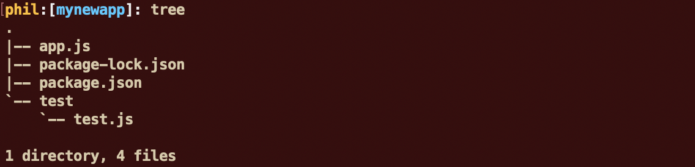

Looking at the **app.js** file in detail, it contains the following:

```javascript
const app = require('express')()

app.get('/', (req, res) => {
  res.send("Hello from Appsody!");
});

module.exports.app = app;
```

This creates an instance of an Express.js application, and then registers a handler for `get()` requests on `/`that `send()` a response of `"Hello from Appsody!"`.

And the **package.jason** contains all the dependencies for your app.js:

```json
{
  "name": "nodejs-express-simple",
  "version": "0.1.0",
  "description": "Simple Node.js Express application",
  "license": "Apache-2.0",
  "main": "app.js",
  "repository": {
    "type": "git",
    "url": "https://github.com/appsody/stacks.git",
    "directory": "incubator/nodejs-express/templates/simple"
  },
  "scripts": {
    "test": "mocha"
  },
  "devDependencies": {
    "chai": "^4.2.0",
    "mocha": "~6.1.0",
    "request": "^2.88.0"
  }
}

```

The crucial characteristic that is required for the application to work with the `nodejs-express` Appsody Stack is that the application exports the create Express.js `app` using the following line:

Now you can run the app from the command line directly:

```bash
appsody run
```

Results:

```bash
Running development environment...
Pulling docker image kabanero/nodejs-express:0.2
Running command: docker pull kabanero/nodejs-express:0.2
0.2: Pulling from kabanero/nodejs-express
Digest: sha256:4ebaf69ff17c011a54f857099ef4fa6ba5042afb91dfcb57df96e2f84cdee4bf
Status: Image is up to date for kabanero/nodejs-express:0.2
docker.io/kabanero/nodejs-express:0.2
Running docker command: docker run --rm -p 3000:3000 -p 8080:8080 -p 9229:9229 --name mynewapp-dev -v /Users/phil/sample/t2i/mynewapp/:/project/user-app -v mynewapp-deps:/project/user-app/node_modules -v /Users/phil/.appsody/appsody-controller:/appsody/appsody-controller -t --entrypoint /appsody/appsody-controller kabanero/nodejs-express:0.2 --mode=run
[Container] Running APPSODY_PREP command: npm install --prefix user-app
added 170 packages from 578 contributors and audited 295 packages in 3.789s
[Container] found 0 vulnerabilities
[Container] 
[Container] Running command:  npm start
[Container] 
[Container] > nodejs-express@0.2.6 start /project
[Container] > node server.js
[Container] 
[Container] [Sat Oct 12 15:29:54 2019] com.ibm.diagnostics.healthcenter.loader INFO: Node Application Metrics 5.0.5.201910041526 (Agent Core 4.0.5)
[Container] [Sat Oct 12 15:29:55 2019] com.ibm.diagnostics.healthcenter.mqtt INFO: Connecting to broker localhost:1883
[Container] App started on PORT 3000
```

As you can read from that short log, appsody is going to do the following things:

- pull a standard docker image for your application
- use docker on your laptop to build an image with your code (from the local directory)
- control the vulnerabilities on your code
- run this image on your local Docker instance
- Diagnostics and metrics will be added automatically

Connect to the application in your browser: [http://localhost:3000](http://localhost:3000/)

``` http
http://localhost:3000
```


## Task #6 - Installing Codewind

Installing **Codewind**, you need to install first **Eclipse** or **Visual Studio Code**. For the simplicity, we decided to install Visual Studio code for this exercise. 

If you don't have **Visual Studio Code** on your laptop, go to that link (the installation is very quick):

<https://code.visualstudio.com/download>

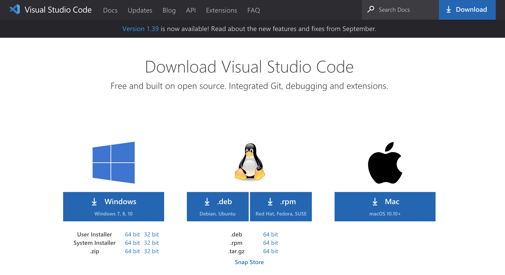

 Then you can install Codewind as an extension of Visual Studio Code.

Install Codewind from the **VS Code Marketplace**, or by searching for Codewind in the **VS Code Extensions view.**


If you’re going to work on Java projects, also install the Java Extension Pack.

Codewind requires the installation of **additional Docker images** to run. Choose Install when prompted to complete the installation. The installation may take a few minutes to complete.

Codewind creates a folder called **codewind-workspace** within your home directory (C:\codewind-workspace on Windows) to contain your projects. When the installation is complete, you can open the codewind-workspace folder or a project within the workspace as your VS Code workspace. The tools offer to open the workspace for you if it’s not open already.

You will see Codewind at the bottom left part of the screen.


To work with an existing project, right-click the *Projects (Local)* item and select **Add Existing Project**, or click on the *link* icon beside the *Projects (Local)* item. Note that the project must already exist within the `codewind-workspace` folder.


##Task #7 - Managing your project 

Click on the link icon and choose mynewapp and then click OK. 


After a few seconds, your project is now associated to Codewind:


As you can see your code is running and of course the build has been done successfully. 

Move your cursor on mynewapp line and click on the end point to get access to the application:

 

A browser session will open shortly:


Now you can navigate on the left top pane to locate the project (mynewapp) and the program (app.js), click on the program (it will appear in the right pane):

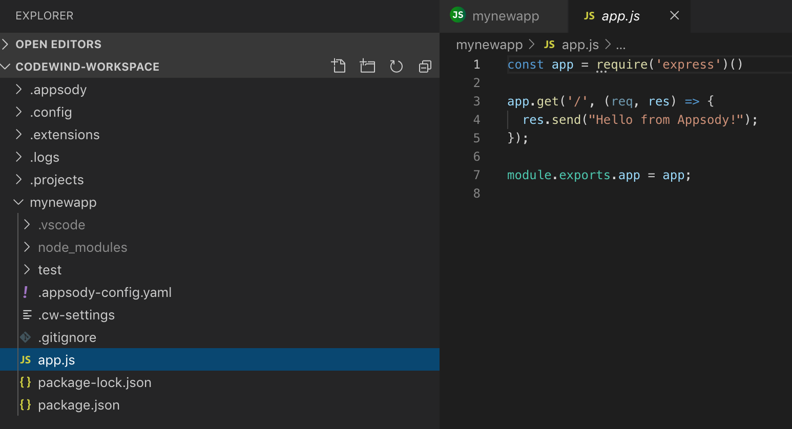

Change the "Hello from Appsody" by "**Hello from Philippe**"or any message of your choice. 

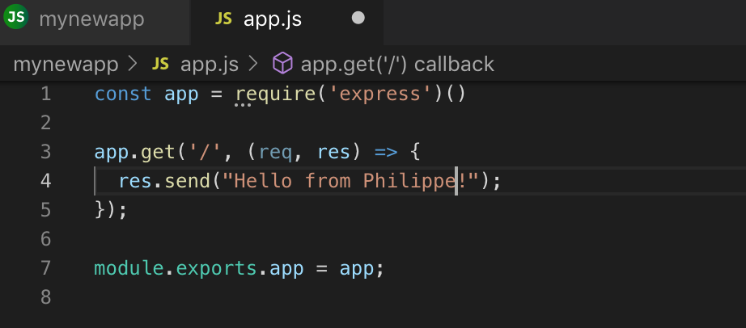

Save your project. Automatically a new build of your project is started and you change is operational:


Now let do some experiments, **right click** on **mynewapp** project in Codewind:


These commands are **Appsody** commands. 


##Task #8 - Managing performance

Click on the **Application Monitor** entry. A new session opens in your browser:

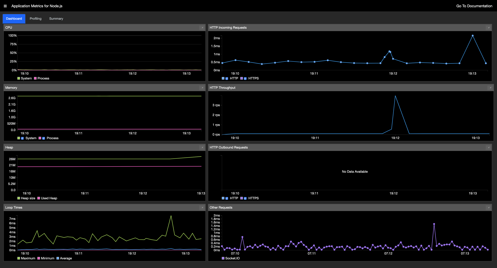

Appsody is cheching the health of your application automatically and you can see all the metrics (CPU, memory, heap size, http requests, throughput ...). Go back to your application and click enter a few times. You will notice some peacks

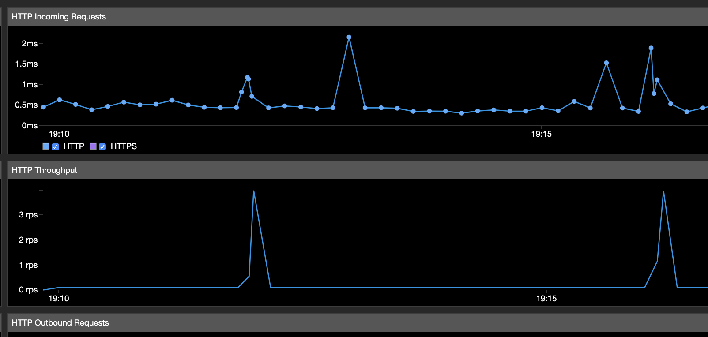


Now let's do some performance tests. Right click on your project:

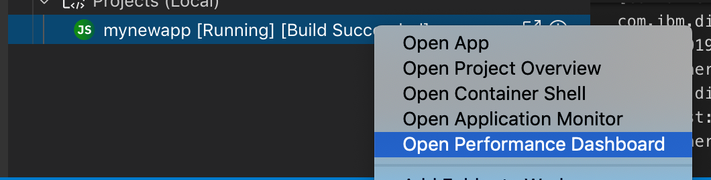


The following screen appears: 

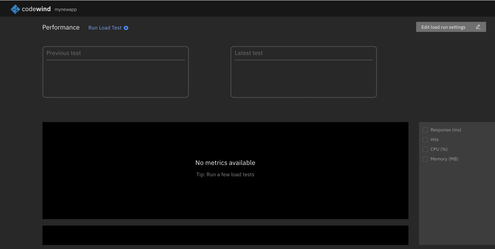

Click on the blue link (Run Load Test) and fill the form with `1#Test` and click **Run**:


Then a performance test is running on your application:


And after a few seconds, you see the results. 

You can repeat this operation several times with 2#Test and 3#Test.

Also tick all the boxes on the right pane:


## Task #9 - Deploy your app

Before you start deploying the application, you need to copy the certificate from the GitHub to your laptop.

**<u>IMPORTANT STEP</u>**

The certificate file is **client-ca.crt**. Download this certificate from the GitHub repository to your laptop.

Then **double-click** on the certificate file and import the certificate into your security operating system (this could be a different process if you are using Windows or MacOS).  

Once this certificate is trusted, you should :

- Restart Docker
- Restart the terminal that you are using


> IMPORTANT: this certificate is mandatory if you want to deploy the image to a secure registry.
>
> In the appendix, there is also another procedure to download and activate the certificate.
>
> This file **/etc/origin/node/client-ca.crt** is located in the master.


Back to the terminal or the command line window. Check that you are still logged to your cluster:

```bash
oc login https://<cluster master hostname>:8443
```

Check or re-assign your project:

```bash
oc project labproj<xx>
```

Results:

```
oc project
Using project "labproj01" on server "https://nice-cluster-3f022ac5fd-master-0.IBM-OpenShift.cloud:8443".
```

Your OpenShift registry is located at : **docker-registry-default.apps.<infraIP@>.xip.io**

In your application directory **newappproj**, login to your Docker registry in your cluster:

``` 
docker login docker-registry-default.apps.<infraIP>.xip.io -u openshift -p $(oc whoami -t) 
```

Example:

```
docker login docker-registry-default.apps.158.176.105.11.xip.io -u openshift -p $(oc whoami -t) 
```

Results:

```bash
WARNING! Using --password via the CLI is insecure. Use --password-stdin.
Login Succeeded
```


> If you receive an error message with X509,  you must add the **client-ca.crt** certificate on your system. This file is in the github in the same repository. 


Be sure to be on your application directory:

```bash
cd
cd codewind-workspace/mynewapp
```


Now you can deploy your appliocation to the remote OpenShift cluster in your project (**change xx** with your number)

```bash
appsody deploy -t docker-registry-default.apps.<infraIP@>.xip.io/labproj<xx>/mynewapp --push --pull-url docker-registry.default.svc:5000 -n labproj<xx>
```


Results (example)

```
...
Successfully built e205b6314730
[Docker] Successfully tagged docker-registry-default.apps.158.176.135.51.xip.io/labproj01/mynewapp:latest
Pushing image docker-registry-default.apps.158.176.135.51.xip.io/labproj01/mynewapp
Built docker image docker-registry-default.apps.158.176.135.51.xip.io/labproj01/mynewapp
Found existing deployment manifest /Users/phil/codewind-workspace/mynewapp/app-deploy.yaml
Updated existing deployment manifest /Users/phil/codewind-workspace/mynewapp/app-deploy.yaml
Attempting to get resource from Kubernetes ...
Running command: kubectl get pods -o=jsonpath='{.items[?(@.metadata.labels.name=="appsody-operator")].metadata.namespace}' --all-namespaces
Attempting to get resource from Kubernetes ...
Running command: kubectl get deployments -o=jsonpath='{.items[?(@.metadata.name=="appsody-operator")].metadata.namespace}' -n adminproj
Attempting to get resource from Kubernetes ...
Running command: kubectl get pod -o=jsonpath='{.items[?(@.metadata.labels.name=="appsody-operator")].metadata.name}' -n adminproj
Attempting to get resource from Kubernetes ...
Running command: kubectl exec -n adminproj -it appsody-operator-67dfc7bc59-5xxch -- /bin/printenv WATCH_NAMESPACE
Attempting to apply resource in Kubernetes ...
Running command: kubectl apply -f /Users/phil/codewind-workspace/theapp/app-deploy.yaml --namespace labproj01
Appsody Deployment name is: theapp
Running command: kubectl get rt theapp -o jsonpath="{.status.url}" --namespace labproj01
Attempting to get resource from Kubernetes ...
Running command: kubectl get route theapp -o jsonpath={.status.ingress[0].host} --namespace labproj01
Deployed project running at mynewapp-labproj01.apps.158.176.135.51.xip.io
```


> If you receive an error message with X509,  you must add the **client-ca.crt** certificate on your system. This file is in the github in the same repository. Be sure to restart Docker after adding the certificate.


You can now get access to your application:

```https
http://mynewapp-labproj<xx>.apps.<infraIP@>.xip.io
```

 


## Conclusion

You successfully installed and used Appsody, Kabanero and Codewind ! You used most of the features concerning Codewind and Appsody. These tools are solving a lot of complexity for the developers. 

**Congratulations**


## Appendix - Get the certificate (registry security)

Instead of copying the certificate (**client-ca.crt** from the GitHub or from the master in **/etc/origin/node/client-ca.crt** ), you can also import the certificate by using **FireFox**.


Folow the steps:

1- Open a **FireFox** browser and type the following URL (don't forget the /v2 at the end) :

```
https://docker-registry-default.apps.<infraIP@>.xip.io/v2
```

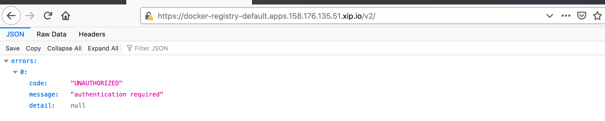

A message showing UNAUTHORIZED will appear.


2- Click on the **locker**

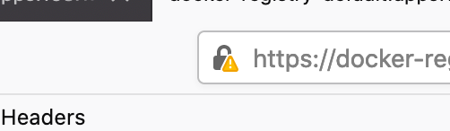


3- Click on **Connection not secure**

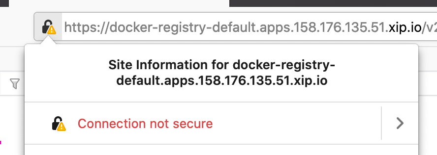


4- Click on **More information**

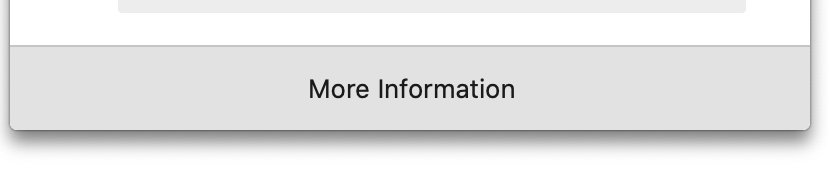

5- Click on **View Certificate**

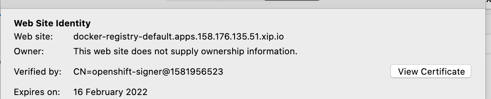


6- Click on Download PEM(cert)

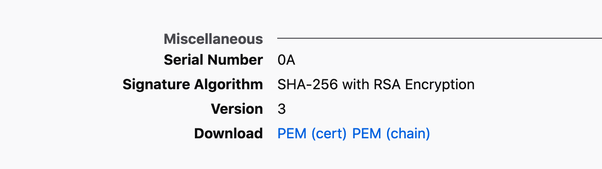 


7- Then Save

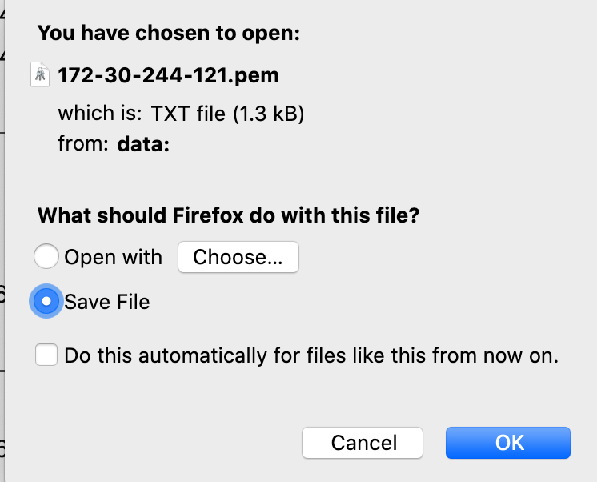


8- Then **Double-Click on the pem file** and add it to the security system.

Depending on the OS used (Windows or MacOS), the procedure will vary.


9- **Restart Docker** and **restart your terminal** (or command line window)


----

----


# End of Lab


